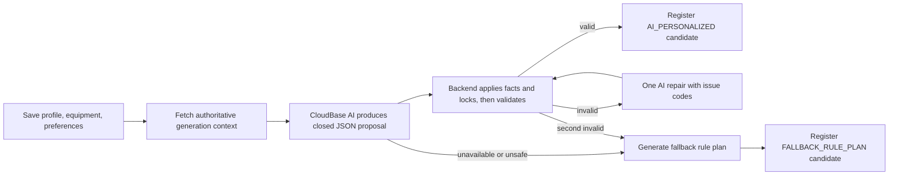

# AI-primary plan generation design

## Responsibility boundary

The AI is the primary source of plan structure: plan name, training-day split, exercise
selection/order, work sets, repetition range, and rest within the published bounds. The
backend is the acceptance authority. It derives weight state, applies locks, validates the
proposal, and is the only component allowed to register an activatable candidate.

The deterministic generator remains only as a compatibility and availability fallback.
Session duration is an upper-bound input to estimation; there is no duration-to-exercise-count
rule or underfilled-count warning.

## Flow

## API

- `GET /api/v1/plans/generation-context?profileVersion={version}`
  returns the normalized profile, eligible exercise whitelist, preferred flags, numeric and
  time-estimation constraints, and the active rule reference.
- `POST /api/v1/plans/candidates` adds:
  - optional `additionalRequirements`;
  - optional closed `aiProposal`;
  - optional `fallbackAllowed` (defaults to `true` for old clients).
- Candidate responses add `generationSource` with `AI_PERSONALIZED` or
  `FALLBACK_RULE_PLAN`.

The AI proposal intentionally omits `templateCode`, locks, weight status, and target weight.
The server fixes the template code to `AI_PERSONALIZED`, derives bodyweight versus calibration
state from the exercise catalog, and attaches the current rule reference.

## Client orchestration

`saveProfileAndGenerateCandidate` saves the three versioned onboarding resources, fetches the
generation context, and calls a dedicated `AiPlanGenerator` port. The CloudBase implementation:

1. serializes context and additional requirements as JSON facts;
2. uses a system prompt that treats user text as data and requires one closed JSON object;
3. parses and validates output size, keys, values, whitelist membership, duplicate codes,
   numeric bounds, day count, and estimated duration;
4. submits the proposal with `fallbackAllowed=false`;
5. retries once with backend issue codes/paths when rejected;
6. requests a separate fallback candidate without an AI proposal only for a typed provider or
   output failure, or after the repaired proposal is rejected.

Provider/model remain configuration-driven. No API key is stored in the mini program.
Authentication, profile-version, generation-context, HTTP, and API-contract errors propagate
to the UI instead of being reclassified as provider unavailability. Existing structured
preferences are preserved unless the user changes them, and onboarding completion is
single-flight at both the page and application-use-case boundaries.

## Backend validation

The proposal evaluation path shares the existing lock merge and `PlanValidationEngine`.
Additional checks require the proposal day count to equal the saved weekly frequency. The
validator continues to enforce:

- eligible exercises and per-day uniqueness;
- 1–8 exercises and 2–6 training days;
- work-set, repetition, and rest bounds;
- movement duplication and primary-muscle volume;
- recovery warnings;
- estimated session duration;
- KG-only and current rule reference.

Warnings do not prevent a candidate. Any error prevents AI candidate registration.
An invalid submitted proposal always returns `NO_CANDIDATE` diagnostics, even when
`fallbackAllowed=true`; fallback generation is a separate proposal-less request so contract
defects cannot be silently hidden.

## Fallback behavior

The fallback generator uses eligible templates, goal-specific prescriptions, compatible
exercise replacement, recovery constraints, and remaining duration. It may add safe accessory
movements only while they fit the time budget. It does not target a fixed exercise count.

Fallback provenance is explicit in the API and UI. The deterministic fallback explanation
does not claim AI personalization.

## Security and privacy

- Additional requirements are limited to 300 characters, checked with Unicode NFKC matching,
  and rejected for control/invisible characters, prompt-control markers, or
  medical/injury/rehabilitation markers.
- Only training-domain facts are sent to CloudBase AI; authentication tokens, identifiers,
  contact data, and raw backend objects are excluded.
- Raw AI output is neither persisted nor logged.
- Unknown properties, unknown exercise codes, absolute weights in numeric fields or names, and
  unsafe text fail closed.

## Verification

- Backend integration tests cover context ownership, profile version conflict, valid 4- and
  5-exercise 45-minute AI proposals, invalid day count/exercise/time/locks, source labels, and
  old-client fallback.
- Client tests cover prompt facts, additional requirements, structured-preference preservation,
  closed-schema validation, Unicode/control safety, absolute-weight rejection, one repair only,
  typed provider/output fallback, contract-error propagation, single-flight submission, and
  source presentation.
- Full gates: backend `mvnw verify`; mini-program API types, typecheck, Vitest, WeChat build,
  boundary scans, `git diff --check`, and independent read-only review.
